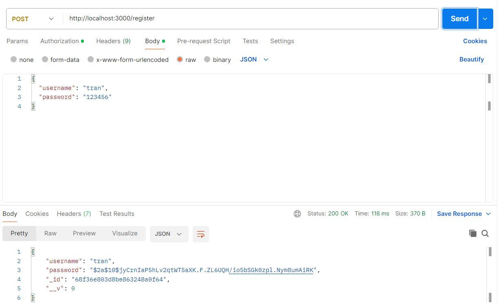
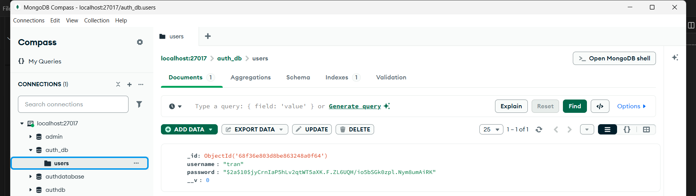
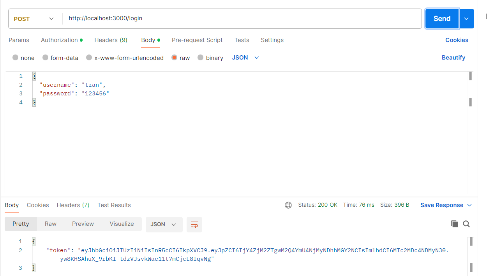
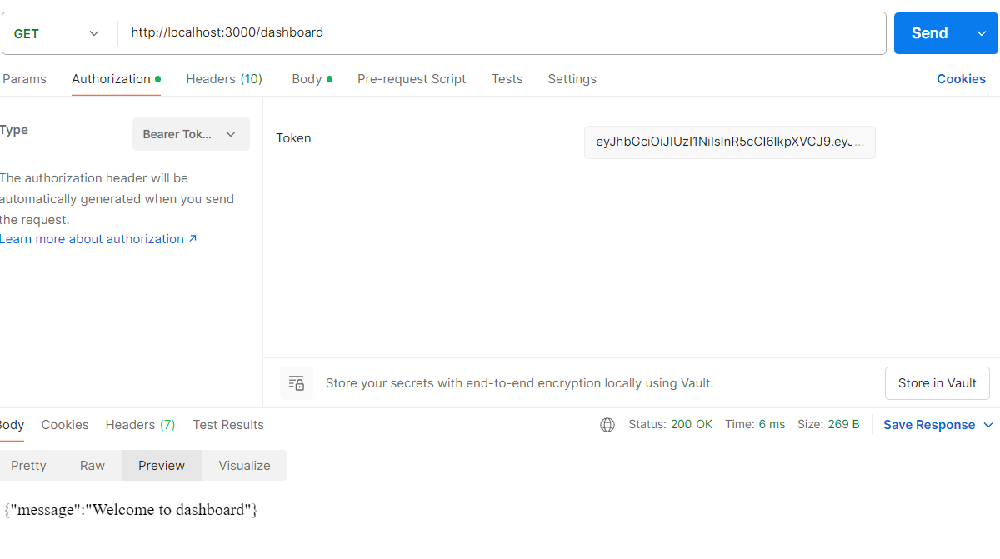
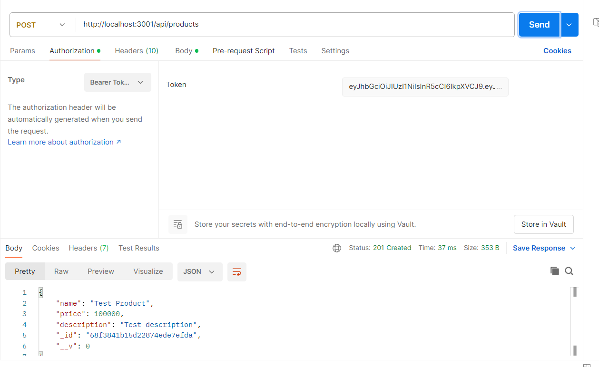
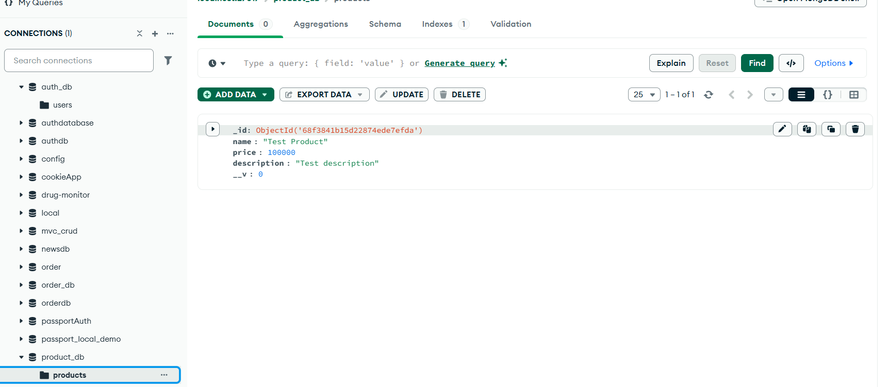
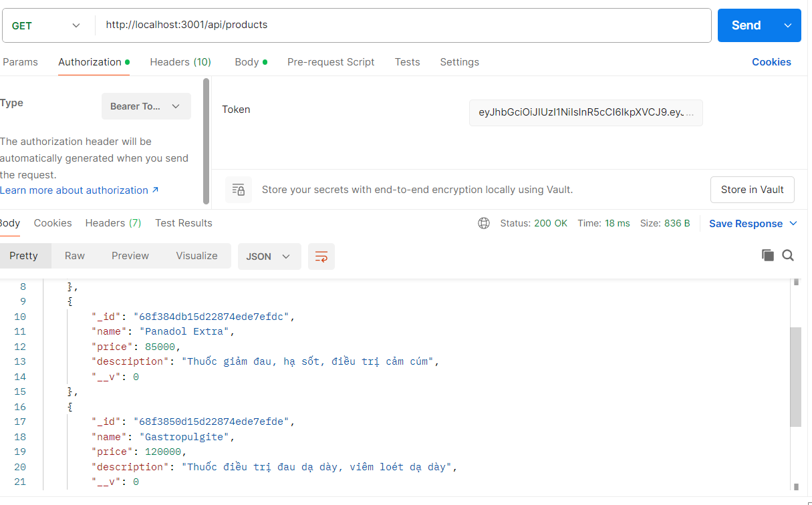
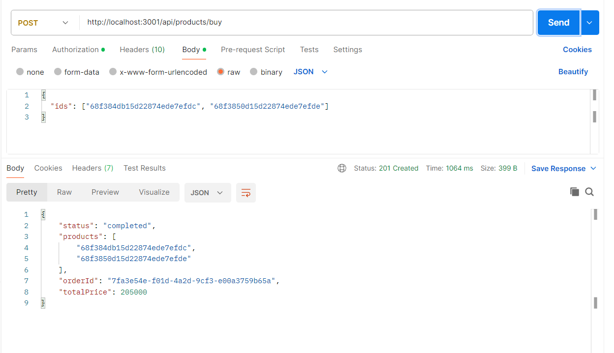
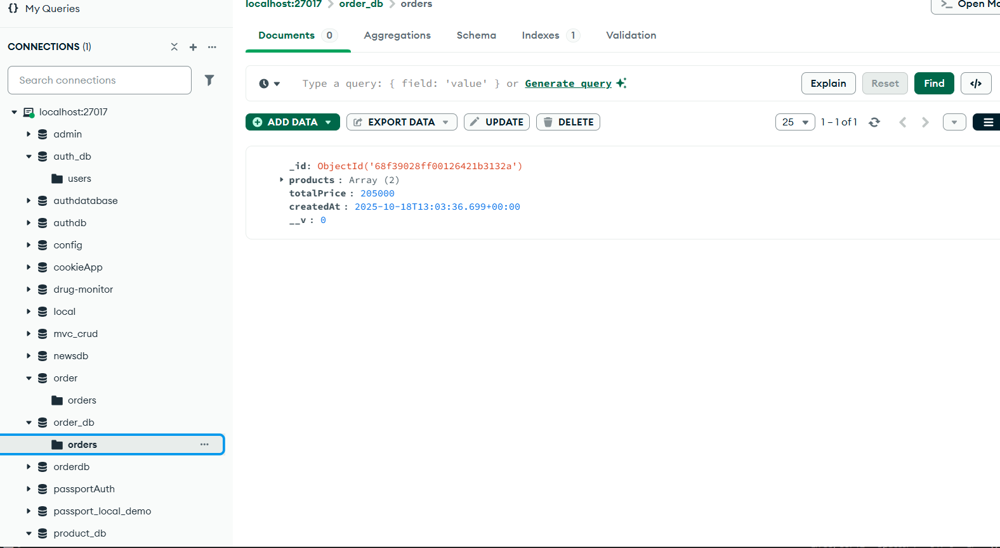
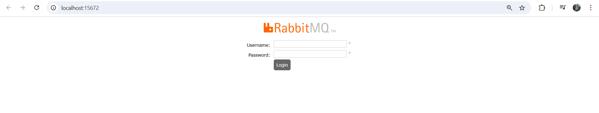

--Nguyễn Vũ Thị Quế Trân
#Khởi động toàn bộ hệ thống container trong nền, dựa theo file docker-compose.yml
## docker-compose up --build

--Test Postmain
## Auth
1. Register 
Method: Get
URL: http://localhost:3000/register
* **Result**

2. Login
Method: Post
URL: http://localhost:3000/login 
* **Result**

3. Dashboard 
Method: Get
URL: http://localhost:3000/dashboard
* **Result**

## Product 
1. Create 
Method: POST
URL: http://localhost:3001/api/products
* **Dữ liệu test**
{
  "name": "Panadol Extra",
  "description": "Giảm đau nhanh, cảm cúm, nhức đầu",
  "price": 90000
}
* **Result**

2. Xem sản phẩm 
Method: Get
URL: http://localhost:3001/api/products
* **Result**

## Order 
1. Tạo Order
Method: Post 
URL: http://localhost:3001/api/products/buy
* **Dữ liệu test**
{
"ids": ["68f9804604a4d102f4511e3c"]
}
* **Result**

## Test localhost

